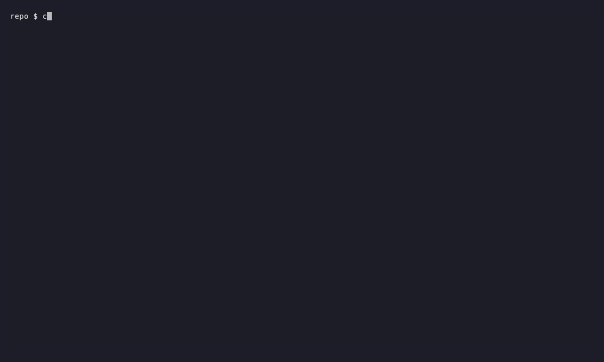

# Git Control Tower (gct)

A terminal UI tool that acts as a "control tower" for Git/GitHub workflows. Oversee your repository, start PR reviews, and clean up branches — all from the terminal.


## Features

- **Branch-centric 2-pane view** — Left sidebar lists branches with PR status, review indicators, and worktree info. Right pane shows git status, PR details with markdown rendering.
- **Filter modes** — Switch between Local branches (`1`), your PRs (`2`), and review-requested PRs (`3`). Toggle merged PRs with `m` and team reviews with `t`.
- **Search** — Press `/` to filter branches by name. Matches are highlighted. Press `Enter` to keep the filter active.
- **Review status** — Color-coded review indicators: needs review (red), approved (green), changes requested (yellow).
- **Action menu** — Press `Enter` to open a context-sensitive menu: copy branch name, open PR in browser, cd into worktree, create/delete worktree, delete branch.
- **Worktree management** — Create worktrees from branches or PRs. Auto-run post-create hooks (copy files, create symlinks, run commands). Force delete worktrees with untracked files.
- **Branch cleanup** — Multi-select branches with `Space`, select all merged with `a`, batch delete with `d`. Force deletes squash-merged branches.
- **Commit log** — View commit history with `l`.
- **Verbose mode** — Run with `--verbose` to surface silenced errors for troubleshooting.

## In motion

**Branch cleanup** — toggle merged PRs, select all merged, batch delete.


**Search & filter** — narrow the sidebar with `/`, then jump between filter modes.


**Worktree post-create hooks** — `.gct.toml` actions (file copy, symlinks, commands) fire automatically when a worktree is created.



## Requirements

- [git](https://git-scm.com/) CLI
- [gh](https://cli.github.com/) CLI (authenticated)
- A terminal with 256-color support

## Installation

### Homebrew (macOS / Linux)

```bash
brew install katzkb/tap/gct
```

Upgrade:

```bash
brew update && brew upgrade katzkb/tap/gct
```

Supported platforms: macOS (Apple Silicon / Intel), Linux (x86_64).

### From source

```bash
git clone https://github.com/katzkb/git-control-tower.git
cd git-control-tower
cargo install --path .
```

## Setup

To enable the "cd into worktree" feature, add the following to your shell configuration:

```bash
# zsh (~/.zshrc)
eval "$(gct shell-init zsh)"

# bash (~/.bashrc)
eval "$(gct shell-init bash)"

# fish (~/.config/fish/config.fish)
gct shell-init fish | source
```

This wraps `gct` with a shell function that captures the worktree path and runs `cd` in your shell.

## Usage

```bash
# Run inside a git repository
gct

# Show version
gct --version

# Enable verbose error output
gct --verbose
```

## Keybindings

### Global

| Key | Action |
|-----|--------|
| `1` | Filter: Local branches |
| `2` | Filter: My PRs |
| `3` | Filter: Review requested |
| `l` | Log view |
| `?` | Help |
| `q` | Quit |

### Main View

| Key | Action |
|-----|--------|
| `j` / `k` | Navigate sidebar |
| `/` | Search branches |
| `Enter` | Action menu |
| `Space` | Toggle branch selection |
| `a` | Select all merged branches |
| `w` | Create worktree |
| `d` | Delete selected branches / worktree |
| `m` | Toggle merged PRs (My PR / Review) |
| `t` | Toggle team reviews (Review only) |

### Log View

| Key | Action |
|-----|--------|
| `j` / `k` | Navigate commits |
| `Esc` | Back to main view |

## Configuration

gct reads configuration from the first file found in this order:

1. `.gct.toml` in the repository root (project-local)
2. `~/.config/gct/config.toml` (global)
3. `~/.gct.toml` (global)

Project-local config is useful for per-repo worktree hooks (e.g. copying `.env`, running `npm ci`).

### Worktree Settings

```toml
[worktree]
# Base directory for new worktrees (default: "..")
# Branch name becomes the subdirectory: feature/auth → ../feature/auth
dir = ".."

# Post-create hooks run automatically after worktree creation.
# Errors are non-fatal — the worktree is created even if hooks fail.

# Copy files from the main worktree
[[worktree.post_create]]
type = "copy"
from = ".env"
to = ".env"

# Create symlinks to shared directories
[[worktree.post_create]]
type = "symlink"
from = "node_modules"
to = "node_modules"

# Run shell commands in the new worktree
[[worktree.post_create]]
type = "command"
command = "npm ci"
```

### Protected Branches

Protected branches are excluded from the `[merged]` label, yellow name color, and all deletion actions (`space`, `a`, action menu). Default: `["main", "master", "develop"]`.

```toml
# Override the default list — useful if your team uses `staging`, `release`, etc.
protected_branches = ["main", "develop", "staging"]

# Or disable protection entirely
# protected_branches = []
```

Branch names are matched case-sensitively.

## Regenerating the demo GIFs

The README's GIFs are produced by [VHS](https://github.com/charmbracelet/vhs) against a fully reproducible local fixture (a fresh git repo + a `gh` shim that returns canned JSON). No GitHub account is needed.

```bash
brew install vhs        # one-time
make demos              # rebuild gct + re-record all four GIFs
make demos-hero         # one scene at a time
```

See `scripts/demo/` for the tape files, fixtures, and setup script. When a new `gh` invocation is added to gct, extend `scripts/demo/gh-stub` accordingly so the recording stays self-contained.

## License

Licensed under either of

- Apache License, Version 2.0 ([LICENSE-APACHE](LICENSE-APACHE))
- MIT License ([LICENSE-MIT](LICENSE-MIT))

at your option.
